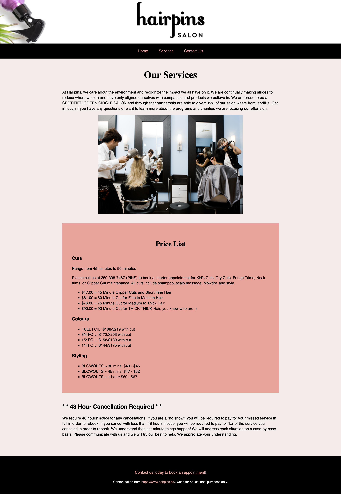
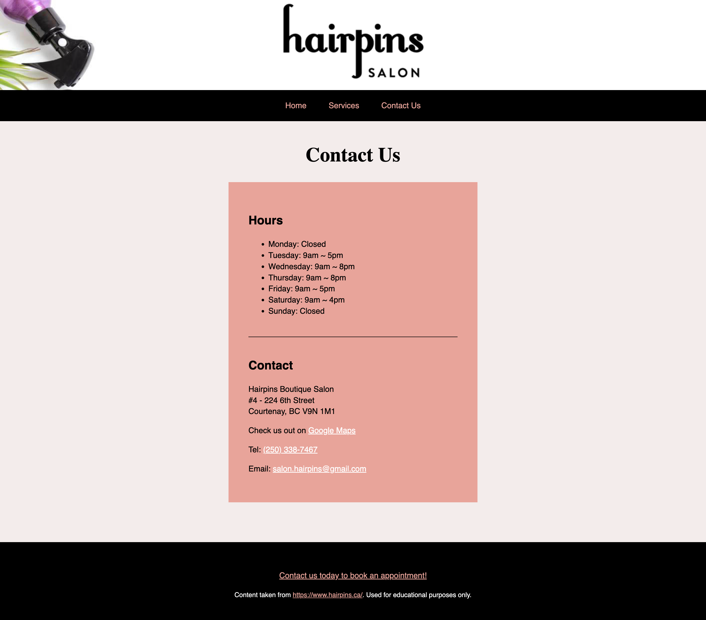

# Exercise 3 - CSS Essentials

## Objectives
The provided code is the HTML and CSS for the home page and story page of a website inspired by a local company. However, the CSS is missing all of its selectors! You need to figure out which HTML elements to apply each style rule to, so that your finished website looks like the images below. After that, you will write some HTML and CSS of your own.





## Instructions
Remember to:
* Regularly save your files and check out what your web page looks like in a web browser.
* Make regular commits and label them appropriately to document your progress.
### Step 1: Add the selectors
1. Use GitHub Desktop to clone your remote exercise repository onto your local machine.
2. Open the repository in VS Code. Open index.html in VS Code and in the browser. If you have the "Open in Browser" VS Code extension installed, you can right-click anywhere in the editor window of an HTML file and select Open in Default browser from the pop-up menu. 
3. Open style.css and type appropriate selectors for every style. Refresh the page in the browser to see your edits. You may need to use class, element (type), descendant or combination selectors. You do not need to edit the HTML - there is no need to add CSS class names to the HTML. There are many different correct ways that you could complete this exercise. I recommend that you don't delete any of the comments as you may need to refer back to them.
Example: 
```
/* all the paragraphs */ 
  {
  color: red;
}
```
The above CSS comment refers to the p selector:
```
/* all the paragraphs */
p {
  color: red;
}
```
4. Repeat the same process for the Service and Contact pages<br>

Notes: 
* The provided code includes HTML elements and CSS properties that you haven't learned about yet. That's ok because this exercise is about understanding the relationships between the HTML elements and the syntax of the selectors. You don't need to understand all the code to be able to complete the exercise.
* Reminder: The syntax of a CSS comment is different to the syntax of an HTML comment.<br>
* Pay attention to how CSS comments were used to identify and organise different groups of style rules. Adding organizational comments doesn't affect the code, but it helps you keep your CSS tidy and easier to read. 
* You can use the browser inspect tools to help you. In the browser window, right-click > Inspect to see the HTML code rendered by the browser.

### Step 2: Write your own code
1. Add a new block of content at the bottom of the homepage. You will need to write the content, HTML and CSS yourself. Include at least five different HTML elements in your new block of content.
2. Style your new content using all of the following:
    * An ID selector
    * A class selector
    * A descendant selector
    * An internal (embedded) style rule
    * An inline style rule

### Step 3: Format and add comments 
1. Use the Prettier VSCode extension to format your code (Right-click > Format document)
2. Add a few comments to explain your HTML and CSS code and highlight anything of interest.

### Step 4: Check for errors
1. Use the VSCode HTMLHint extension and the browser inspect tools to help you troubleshoot errors.
2. Validate your HTML code to check for errors: https://validator.w3.org/#validate_by_upload. Take a screenshot of the results.
3. Validate your CSS code to make sure that it is correct: https://jigsaw.w3.org/css-validator/ for CSS. Take a screenshot of the results.

**You have now completed your exercise but you still need to push your edits to GitHub and submit it in Brightspace. Make sure to follow the instructions in the How to Complete Your Exercises Guide. You will need to submit the screenshots of your HTML and CSS validation results.**
